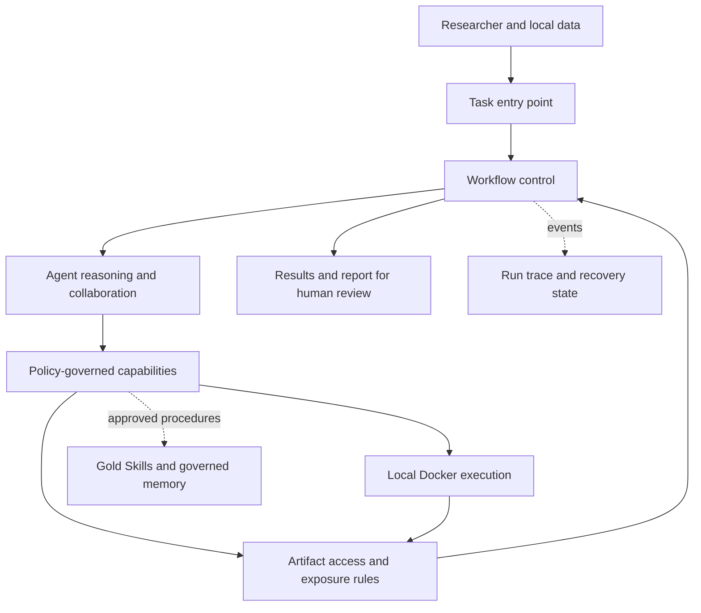

# LabBioAgentOS

**A research-stage framework for reproducible, governed bioinformatics agents.**

LabBioAgentOS connects natural-language scientific tasks to a structured workflow, local analysis execution, and traceable results. It is designed to keep biological data, model reasoning, and system control within explicit boundaries so that a run can be inspected, resumed where safe, and reviewed by a human.

> **中文简介：** LabBioAgentOS 是一个面向生物信息学研究的智能体框架。它将自然语言任务、分阶段工作流、本地受控执行、结果溯源和人工审核连接起来。目前仍处于研究与开发阶段，生成的分析和科学结论需要研究人员核查。

## The idea

Bioinformatics tasks rarely end with a single model response. They involve selecting inputs, choosing an analysis strategy, running code, checking outputs, interpreting evidence, and reporting limitations. LabBioAgentOS gives these steps a common control and record-keeping structure while leaving task-specific scientific choices to the runtime agent.



The workflow follows a staged path:

`INTAKE → UNDERSTAND → PLAN → PREFLIGHT → EXECUTE → VALIDATE → INTERPRET → REPORT → LEARN`

The control layer owns run state and checks transitions. Agents work within a stage and propose the next step. The execution and artifact layers enforce local data access, resource limits, and what can be shown to a remote model.

## What is in the repository

- **Workflow and runtime integration:** typed stage results, explicit transitions, agent collaboration, and bounded tool access.
- **Local execution:** policy-controlled Docker execution with registered inputs, outputs, and execution receipts.
- **Artifact governance:** scoped artifact identities, exposure decisions, and bounded views of derived results.
- **Trace and continuation:** persisted run state, event records, status inspection, and guarded continuation or revision of earlier runs.
- **Researcher oversight:** user decisions for sensitive workflow actions and user-approved, reusable Gold Skills.
- **Local entry points:** a `labbio` command-line interface for submitting tasks and inspecting results, with an optional managed local workspace mode.

These are framework capabilities, not a catalogue of validated biological pipelines. The agent's analysis strategy, generated code, and interpretation depend on the configured model, data, tools, and human review.

## Try the local entry point

The current setup expects Python 3.11+, a configured model provider, and a local Docker environment with a suitable scientific image. Review the [local task guide](docs/LOCAL_TASK_ENTRYPOINT.md) and [runtime requirements](docs/UPSTREAM_MODIFICATIONS.md) before installing; the runtime requires a specific development revision that the package version range alone does not select.

After configuring an allowed input directory, result directory, provider credentials, and Docker image outside the repository, a task looks like this:

```bash
labbio run \
  --data /path/to/allowed/input.h5ad \
  --format h5ad \
  --task "Summarize this dataset, save the results, and report limitations."
```

The command submits a request; it does not guarantee that a model will complete a valid analysis. See the [local workspace guide](docs/LOCAL_WORKSPACES.md) for project-scoped use and the [conversation guide](docs/CONVERSATION_CONTINUATION.md) for history, clarification, continuation, and revision.

## Project status

LabBioAgentOS is an active research prototype. Its core architecture and local execution path have been tested, including an end-to-end sandbox-to-report run. It has **not** been released as a production service, and framework checks do not establish scientific correctness. Provider behavior, data quality, analysis methods, and reported conclusions require independent evaluation. Current boundaries are documented in [Known Limitations](docs/KNOWN_LIMITATIONS.md).

## Architecture and development notes

- [Architecture](docs/LABBIO_ARCHITECTURE.md)
- [Roadmap](Roadmap.md)
- [Runtime integration and capability map](docs/RUNTIME_INTEGRATION_MAP.md)
- [Known limitations](docs/KNOWN_LIMITATIONS.md)

## Runtime acknowledgement

The current version draws substantially on and depends on [PantheonOS](https://github.com/aristoteleo/PantheonOS) for agent runtime capabilities. LabBioAgentOS develops its workflow, execution, artifact, and governance layers in this repository. A more independent runtime core is a future direction, not a capability claimed for the present version. See [runtime provenance](docs/UPSTREAM_MODIFICATIONS.md) for the exact development dependency.
